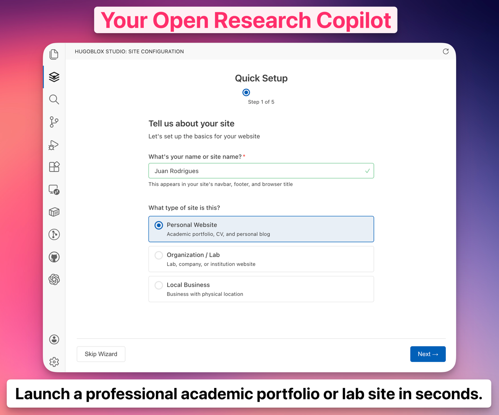
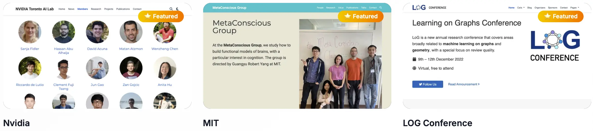

<<<<<<< HEAD
# [The Academic CV That Gets You Hired](https://github.com/HugoBlox/hugo-theme-academic-cv)

[](https://hugoblox.com/templates/academic-cv/start/?utm_source=github&utm_medium=readme)

<h1 align="center">The Portfolio That Works While You Sleep</h1>

<p align="center">
  <strong>Your unfair advantage in academia.</strong><br/>
  Stop sending PDFs into the void. Build a living portfolio that boosts citations and lands offers.<br/>
  Trusted by 250,000+ researchers at <strong>MIT, Stanford, and Google</strong>.
</p>

<p align="center">
  <a href="https://hugoblox.com/templates/academic-cv/start?utm_source=github&utm_medium=readme"><b>🚀 Launch Free (60s)</b></a>
  &nbsp;•&nbsp;
  <a href="https://hugoblox.com/templates/?open=academic-cv&loading=true&utm_source=github&utm_medium=readme">Live Demo</a>
  &nbsp;•&nbsp;
  <a href="https://marketplace.visualstudio.com/items?itemName=ownable.ownable"><b>Visual Editor</b></a>
</p>

<p align="center">
  <a href="https://discord.gg/z8wNYzb"></a>
  <a href="https://github.com/HugoBlox/hugo-theme-academic-cv"></a>
</p>

---

## Why This Template?

Most CVs are static PDFs that get lost in the pile. This is an **intelligent portfolio** that works 24/7 to advance your career.

- **🔮 Future-Proof:** Your content lives in simple **Markdown**. No database to break, no lock-in.
- **🤖 AI-Ready:** Optimized for search engines and LLMs, so your work is found and cited.
- **⚡ Zero Maintenance:** Auto-import citations from BibTeX and focus on research.
- **✍️ Edit Visually:** Use **HugoBlox Studio** in VS Code — no coding needed. Full capabilities in Pro.

<p align="center">
  <a href="https://hugoblox.com/templates/academic-cv/start?utm_source=github&utm_medium=readme">
    
  </a>
</p>


*HugoBlox Studio: Drag-and-drop page builder inside VS Code.*

> "My citations went up 3x after switching to this template. The citation auto-sync feature is a lifesaver."
> — **Dr. Zhang**, AI Research Scientist, Meta

---

## Who This Is For

- Students and grads applying to top labs and industry roles
- Researchers who want a living, citable portfolio
- Faculty/PIs showcasing publications, talks, and group news

---

## Features

| Feature | Benefit |
| :--- | :--- |
| **Markdown, Jupyter, RStudio** | Write in the tools you already use. |
| **Auto-Update Citations** | Drop in a BibTeX file; formatted lists generated automatically. |
| **Visual Editor** | Drag-and-drop blocks to build pages in minutes. |
| **Global CDN** | Blazing fast load times (100/100 Lighthouse scores). |
| **Privacy First** | You own your data. Host for free on GitHub Pages. |

---

## Notebook → Posts and Slides

- Publish your actual `.ipynb` as beautiful long-form posts — code, outputs, and narrative kept intact.
- Slides in Markdown with Reveal.js: math, syntax highlight, diagrams, speaker notes.
- Coming soon: **Notebook → Slides (beta)**. Request early access in Discord.

Learn more: docs on [Notebooks](https://docs.hugoblox.com/reference/markdown/#-notebooks) and [Slides](https://docs.hugoblox.com/guides/slides/).

---

## Why Go Plus (from $4/m)

- Enhanced HugoBlox Studio visual editor — save 10–20 hours setting up and polishing
- Make an unforgettable first impression
- Priority support

---

## Free vs Pro

| Feature | Academic CV (Free) | Academic CV Pro & Resumé Pro |
| --- | --- | --- |
| Design | Professional & clean | Premium designs |
| Layouts | Standard sections | Advanced timelines & layouts |
| Courses/Lectures | Basic | Fully-Featured |
| First Impression | Strong | Unforgettable |
| Discord Support | Community | Priority |

<p align="center">
  <a href="https://hugoblox.com/pricing?utm_source=github&utm_medium=readme"><b>💎 Upgrade to Pro</b></a><br/>
  <a href="https://hugoblox.com/templates/academic-cv-pro/start?utm_source=github&utm_medium=readme">✨ Deploy Academic CV Pro</a>
  &nbsp;•&nbsp;
  <a href="https://hugoblox.com/templates/resume-pro/start?utm_source=github&utm_medium=readme">📄 Deploy Resumé Pro</a>
=======
[**中文**](./README.zh.md)

<p align="center">
  <a href="https://hugoblox.com/start?utm_source=github&utm_medium=readme&utm_content=hero_image">
    
  </a>
</p>

<h1 align="center">HugoBlox: Your Open Publishing Stack</h1>

<p align="center">
  <strong>Publish notebooks, docs, portfolios, and knowledge bases from Markdown + Jupyter.</strong><br/>
  Built for data scientists, AI engineers, researchers, labs, and tech startups who want speed without lock-in: Hugo + Tailwind with optional Researcher Plan automation (visual editing, imports, fixes, and upgrades).
</p>

<p align="center">
  <a href="https://hugoblox.com/start?utm_source=github&utm_medium=readme&utm_content=cta_start"><b>Start Free in Browser</b></a>
  &nbsp;•&nbsp;
  <a href="https://marketplace.visualstudio.com/items?itemName=ownable.ownable"><b>Get HugoBlox Studio (VS Code)</b></a>
</p>

<p align="center">
  <sub>
    <a href="#for-researchers--labs">Researchers & Labs</a>
    &nbsp;•&nbsp;
    <a href="#for-data-scientists--ai-engineers">Data Scientists & AI Engineers</a>
    &nbsp;•&nbsp;
    <a href="#for-teams--orgs">Teams & Orgs</a>
    &nbsp;•&nbsp;
    <a href="#plans">Automations & Plans</a>
  </sub>
</p>

<div align="center">

<a href="https://discord.gg/z8wNYzb">
    
  </a>
  <a href="https://github.com/HugoBlox/kit">
    
  </a>
  <a href="https://x.com/MakeOwnable">
    
  </a>
  <a href="https://marketplace.visualstudio.com/items?itemName=ownable.ownable">
    
  </a>
  <a href="https://marketplace.visualstudio.com/items?itemName=ownable.ownable">
    
  </a>

</div>

<p align="center">
  <sub>
    Trusted since <strong>2016</strong> · <strong>150,000+</strong> researchers and scientists (Meta, Stanford, NVIDIA) · Rated <strong>4.9/5</strong> by users (official survey) · Used by teams like <a href="https://research.nvidia.com/research-labs">NVIDIA Research Labs</a>, <a href="https://cai4cai.ml/">King’s College London</a>, and <a href="https://www.metaconscious.org/">MIT</a> · Featured by GitHub <a href="https://github.blog/open-source/release-radar-february-2019/#hugo-academic-4-0">Release Radar</a>
  </sub>
</p>

https://github.com/user-attachments/assets/a0be0c48-b8d5-4b40-a11b-85fedcdf89bc

---

## ⚡️ Why teams choose HugoBlox

In the age of AI, **Markdown is the new source code**. HugoBlox gives you the speed of modern tooling with the durability of a static stack: **Hugo + Tailwind** (with optional Alpine/Svelte blocks for interactivity).

- **Own your content**: clean Markdown, YAML, and notebooks — portable, readable, and LLM-friendly.
- **Performance without the ops tax**: static output, fast builds, no runtime database.
- **Beautiful by default**: high-quality templates + blocks (and Researcher Plan options when you want more).
- **A hybrid workflow**: edit in code, or use a visual editor when you want velocity.

---

## For researchers & labs

- **Lab sites and academic profiles** (people, publications, projects, news)
- **Citable output** with BibTeX/DOI workflows
- **Notebooks + LaTeX** for technical writing that actually renders

## For data scientists & AI engineers

- **Project docs** and technical blogs without heavy JavaScript stacks
- **Notebook-first publishing** (`.ipynb`) for reports, tutorials, and results
- **Knowledge bases** and internal docs that stay searchable and maintainable

## For teams & orgs

- **Consistent sites** across teams with templates + blocks
- **Lower risk upgrades** with clear versioning + migration guidance
- **Support options** when you need fast answers

---

## 🧠 Edit the way you like (code-first, visual when you want it)

- **Code-first**: Markdown/YAML + Hugo templates for full control.
- **Visual editing (Researcher Plan)**: **HugoBlox Studio** in VS Code for drag-and-drop blocks, previews, and safer config edits.
- **AI automation (Researcher Plan)**: spend less time on formatting, YAML fixes, imports, and maintenance.

<p align="center">
  
</p>
<p align="center"><em>HugoBlox Studio: Visual editing meets code-first control.</em></p>

---

## 🛠️ The toolkit

| **Feature** | **Why it matters** |
| :--- | :--- |
| **HugoBlox Studio (VS Code)** | A visual CMS inside your editor. Drag-and-drop blocks without leaving VS Code. |
| **Notebooks & LaTeX** | Render `.ipynb` and math-heavy pages natively. |
| **BibTeX / DOI workflows** | Build publication pages and bibliographies without manual formatting. |
| **Polyglot Support** | Write in Markdown, Jupyter, RMarkdown, or LaTeX Math. |

<p align="center">
  
</p>

<p align="center">
  <a href="https://hugoblox.com/templates?utm_source=github&utm_medium=readme&utm_content=templates"><b>Browse Templates →</b></a>
</p>

<p align="center">
  <sub>Want to see it working fast? Pick a template and publish in ~60 seconds with the Online Copilot.</sub><br/>
  <a href="https://hugoblox.com/start?utm_source=github&utm_medium=readme&utm_content=cta_template_start"><b>Try a template now →</b></a>
>>>>>>> 0ab5f33d8cceaa17fcdb16569afe42ab2cfeb523
</p>

---

<<<<<<< HEAD
## Get Started

### Option 1: No-Code (Fastest)
Launch a fully hosted site in your browser. No software to install.

👉 [**Launch in Browser (Free)**](https://hugoblox.com/templates/academic-cv/start?utm_source=github&utm_medium=readme)

### Option 2: Studio (Visual Editor)
1) Install [HugoBlox Studio](https://marketplace.visualstudio.com/items?itemName=ownable.ownable) for VS Code  
2) Open this project and edit visually

### Option 3: CLI (Developers)
1) Install [Hugo](https://docs.hugoblox.com/start/cli/)
2) Create your site with the CLI:

```bash
npx hugoblox create site --template academic-cv
```

---

## FAQ

- Do I need to know Hugo? No — you can edit visually or write Markdown.
- Can I host for free? Yes — GitHub Pages/Netlify are supported.
- Can I export/migrate later? Yes — your site is just files.
- Can I cancel Pro anytime? Yes.

---

## Community & Support

- 💬 [**Discord Community**](https://discord.gg/z8wNYzb)
- 📚 [**Documentation**](https://docs.hugoblox.com/?utm_source=github&utm_medium=readme)
- 🐦 [**Follow on X**](https://x.com/MakeOwnable)
- ⭐ [**Star on GitHub**](https://github.com/HugoBlox/kit)

---

MIT © 2016-Present [George Cushen](https://georgecushen.com)

<!--START_SECTION:news-->
<!--Updated at 2026-03-15T01:19:24.898Z-->
<!--END_SECTION:news-->
=======
## 🚀 Get Started

### Option 1: The Online Copilot (Fastest)
Ideal for **founders, labs, and startups**. Launch a site in minutes.

👉 [**Start Free in Browser**](https://hugoblox.com/start?utm_source=github&utm_medium=readme&utm_content=get_started_browser)

### Option 2: HugoBlox Studio (Best for Data/AI teams)
The power of a visual website builder, directly inside VS Code.

1. **Install** [HugoBlox Studio from the Marketplace](https://marketplace.visualstudio.com/items?itemName=ownable.ownable).
2. **Open** any HugoBlox project folder.
3. **Click** the HugoBlox Studio icon in the menu to start visually editing.

### Option 3: The CLI (For DevOps/Eng)
Scaffold a new project locally.

```bash
  # Requires Hugo Extended & Node.js
  npm install -g hugoblox
  hugoblox create site
```

Need guides and best practices? See the docs: [**docs.hugoblox.com**](https://docs.hugoblox.com/?utm_source=github&utm_medium=readme&utm_content=docs)

---

## ✅ Stability & upgrades (because your site should not break)

- **Pin versions** to keep production stable.
- **Upgrade with confidence** using migration notes and upgrade guides.
- **Customize safely**: prefer configuration and blocks over fragile template overrides when possible.
- **Catch config issues early (Researcher Plan)**: visual editing + validation reduces YAML/front matter mistakes.

See the docs for upgrade guidance: [**docs.hugoblox.com**](https://docs.hugoblox.com/?utm_source=github&utm_medium=readme&utm_content=upgrade_guidance)

<a name="plans"></a>
## ⚡️ Unlock Automations & Premium

HugoBlox is **Open Core**. The **Free Kit** is production-grade and you will always own your data and code.

The Free Kit includes:

- **[HugoBlox Studio](https://marketplace.visualstudio.com/items?itemName=ownable.ownable) Core**: Visual site configuration, theming, and content editing
- **Templates + blocks** for portfolios, labs, docs, and landing pages
- **Markdown/YAML-first workflow** with Hugo + Tailwind performance
- **Notebook + LaTeX support** for technical publishing
- **Community support** via docs, GitHub issues, and Discord

### 🤖 Pro (Automation)

Upgrade to **Pro** for [HugoBlox Studio](https://marketplace.visualstudio.com/items?itemName=ownable.ownable) (requires extension login) when you want automation and lower maintenance overhead:

- **Less time debugging YAML** (Fix-it Bot + safer config editing)
- **Less time formatting citations** (Magic Import + publication automation)
- **Less time dealing with upgrades** (guided maintenance workflows)
- **More velocity** (visual editing + previews in VS Code)


| Feature | **Free Kit** (Open Source) | **Pro** (Automation) |
| :--- | :---: | :---: |
| **Site Ownership** | ✅ 100% Yours | ✅ 100% Yours |
| **Visual Page Editor** | ❌ | **✅ Included** |
| **AI Assistant** | ⏳ Trial | **✅ Included** |
| **Auto Sync with GitHub** | ❌ | **✅ Included** |
| **AI "Fix-It" Bot** (Auto-fix YAML) | ❌ | **✅ Unlimited** |
| **Magic Import** (BibTeX/DOI -> Page) | ⏳ Trial | **✅ Unlimited** |
| **CV Generator** (Site -> PDF Resume) | ❌ | **✅ Included** |
| **Private Discord** | ❌ | ✅ |
| **Support Open Research** | 💜 | **🏆 Hero Status** |

👉 [**View Full Feature Matrix**](https://hugoblox.com/pricing?utm_source=github&utm_medium=readme&utm_content=pricing_matrix) &nbsp;•&nbsp; [**Get Pro**](https://hugoblox.com/pricing?utm_source=github&utm_medium=readme&utm_content=cta_pro)

> "HugoBlox Studio saved me **40+ hours** on my lab site. Visual edits + BibTeX auto-updates = **citations up 3×**."
> <br/>— **Dr. Sarah Yang**, AI Researcher

### 🎨 HugoBlox Premium

**Get the complete kit.** Instant access to premium templates, blocks, and community support to help you launch faster.

| Feature | Open Source | **HugoBlox Premium** |
| :--- | :---: | :---: |
| **Core Framework** | ✅ | ✅ |
| **Premium Templates** (SaaS, Lab) | ❌ | **✅ Included** |
| **Premium Blocks** | ❌ | **✅ Included** |
| **Remove Attribution?** | ❌ | **✅ Included** |
| **Private Discord** | ❌ | ✅ |
| **Support Open Research** | 💜 | **🏆 Hero Status** |

👉 [**Get Premium Templates Bundle**](https://hugoblox.com/premium?utm_source=github&utm_medium=readme&utm_content=cta_premium)

> "Launched my startup site with built-in docs in **10 minutes**. The premium block system is genius; onboarding time dropped 60%."
> <br/>— **Alexandre Rodrigues**, Founder

---

## 🏢 Org-ready (without the enterprise bloat)

- **Deploy anywhere**: static output works with your existing infra.
- **Lower ops surface area**: no runtime app to patch.
- **Procurement-friendly options**: priority support and commercial features when you need them.

---

## 🗣️ Community & Support

We are a community of 150,000+ researchers, engineers, and creators.

- **Need Help?** Join the [Discord Server](https://discord.gg/z8wNYzb) or search the [Documentation](https://docs.hugoblox.com/).
- **Found a Bug?** Open an [Issue](https://github.com/HugoBlox/kit/issues).
- **Want to Contribute?** Read our [Contributing Guide](./CONTRIBUTING.md).

### Sponsors
Help us keep open-source sustainable.

[**❤️ Sponsor on GitHub**](https://github.com/sponsors/gcushen) | [**🏢 Become a Partner**](https://github.com/sponsors/gcushen)

---

## License

Copyright © 2016-Present [**Lore Labs**](https://lore.tech/?utm_source=github&utm_medium=readme).
Released under the [MIT License](./LICENSE.md).

<p align="center">
  <sub>HugoBlox™ is a trademark of Lore Labs.</sub>
</p>
>>>>>>> 0ab5f33d8cceaa17fcdb16569afe42ab2cfeb523
